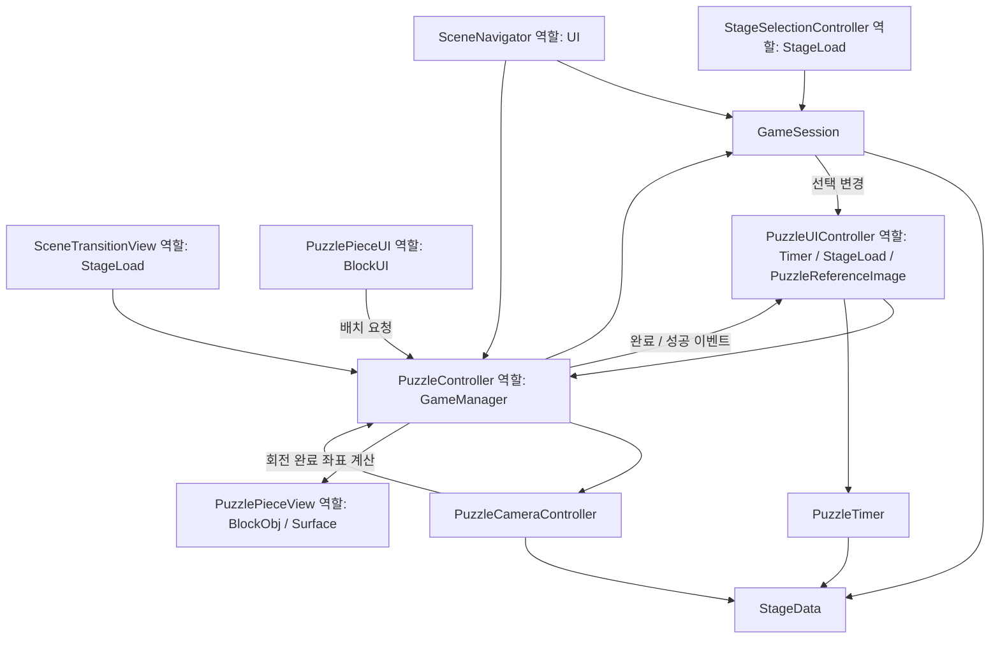

# StackBlock 최종 정리 검증 보고

2026-09-09. 이번 단계에서는 새 런타임 클래스나 아키텍처를 추가하지 않았다. 작업 전 git status와 스크립트 원본, 씬/Resources/설정 532개 파일의 해시를 Logs/FinalCleanupBaseline에 기록했다. 기존 미커밋 작업을 되돌리지 않았다.

## 1–2. 최종 런타임 스크립트와 책임

| 스크립트 | 실제 책임 |
|---|---|
| GameSession | Topic/Stage 선택, StageData 단일 캐시, 선택 변경 알림 |
| StageData | 기존 9개 스테이지의 설정과 이미지/Ground 에셋 참조 |
| GameManager | 퍼즐 생성·Dictionary·카운트다운·진행·점수·경과시간·성공/실패 |
| PuzzleTimer | 순수 시간 모델: 시작/정지/감소/보너스/상한/만료 |
| Timer | 기존 씬 컴포넌트: 시간 모델 실행, Slider 표시, 실패 흐름 연결 |
| PuzzleCameraController | 버튼/A·D/방향키, 90도 회전, 방향의 단일 소유자 |
| StageLoad | 스테이지 버튼 생성, 구름 전환, Puzzle 초기화와 성공 UI 표시 |
| UI | 기존 UnityEvent 씬 이동·재시작·다음 스테이지 함수 |
| PuzzleReferenceImage | 현재 선택된 StageData 미리보기 표시 |
| BlockUI | 드래그 입력·표시 및 배치 요청 |
| BlockObj | 조각 활성화에 따른 종속 Surface 활성화 |
| Surface | Surface 표시 상태에 따른 배치 좌표 갱신 |
| ButtonUI | 기존 버튼 호버 확대/복원 |
| Sound | 기존 음량·음소거·믹서 연결 |

## 3. 구버전 삭제

이번 작업에서 추가 삭제한 런타임 파일은 없다. CameraControl.cs/PointMove.cs는 이전 단계에서 이미 제거되었고 현재 카메라 컨트롤러가 대체한다. Timer/BlockUI/BlockObj/Surface/미리보기/StageLoad/UI는 실제 사용 중이므로 삭제하지 않았다. GameManager.EndTopic, 사용하지 않는 선택 forwarding API와 설정 필드, BlockUI의 빈 OnDrop, 미사용 using과 Debug.Log는 제거했다.

## 4. GameManager 처리

GameManager는 유지한다. 요청에 예시로 등장한 PuzzleController는 현재 저장소에 존재하지 않으므로 점수·진행·Dictionary를 맡을 대체 클래스가 없다. 새 구조를 추가하지 않는 범위를 지켰다.

제거: camera_dir 복사본과 동기화, weather_campos/weather_camrot/structure_campos/structure_camrot, block_distance, 미사용 bgm/ready/drag_block_id, topic/stage/CurrentStageImage forwarding, 빈 EndTopic.

유지: Session 초기 생성용 initialTopic/initialStage, 세션으로 위임하는 CurrentStageData 읽기, Dictionary, 점수, elapsed time, 시작/성공 상태, 완료 개수, 씬 참조와 생성 Ground. 남은 시간 데이터는 GameManager에 없다. CurrentDirection은 카메라의 값을 읽을 뿐 저장하지 않는다.

점수·개수·시작/성공 상태는 private + 읽기 전용 Property로 바꾸었다. puz_num/comlete_num/playing_time은 FormerlySerializedAs로 이전 이름을 보존한다. TryCompletePiece가 방향·거리·선행 Surface·이미 완료 여부·플레이 상태를 재검사하고 점수/완료 알림을 한 번만 처리한다. 외부 UI는 카운터를 직접 쓰지 않는다. Dictionary의 자료구조 자체는 변경하지 않았다.

## 5–6. StageLoad/UI와 호환 코드

StageLoad의 성공 상태 Update 감시를 PuzzleSucceeded 이벤트로 교체했다. 구름 RectTransform은 초기화 시 캐시한다. 생성한 버튼/점수/드래그 인스턴스에 스프라이트를 설정하여 원본 프리팹을 런타임에 변경하지 않는다. UI의 기존 공개 버튼 함수명은 유지했다.

PuzzleReferenceImage의 매 프레임 Topic/Stage 비교는 GameSession.SelectionChanged로 대체했다. 카메라 방향 복사와 SyncLegacyDirection을 제거했다. Cal_Pos는 실제 좌표 계산 함수 RecalculatePlacementPositions로 이름을 정리했고 중간 wrapper는 없다. BlockComplete/BlockFail은 대체 컨트롤러가 없는 실제 성공/실패 처리이므로 남긴다.

Timer는 중복 타이머가 아니다. PuzzleTimer 하나만 시간을 소유하고 Timer는 기존 씬 연결과 표시/실패 처리에 필요하다. 모델의 시간 설정은 StageData만 읽는다. 완료 개수 변화당 보너스 한 번이라는 기존 합산 규칙도 그대로다.

## 7. 남은 레거시와 이유

- GameManager의 지속 수명과 여러 퍼즐 책임, StageLoad의 전환/초기화/성공 표시: 대체 클래스 미도입, 이번 단계는 새 아키텍처 금지.
- Resources 배열 순서와 자식 이름에 따른 종속 관계: 변경 금지 범위이며 현재 9개 스테이지가 이 계약에 의존한다.
- Dictionary는 그대로 노출된 기존 컬렉션이며 변경 가능한 자료구조이다. 조각 상태 프로퍼티와 점수/카운터의 쓰기 경로는 제한했다. 컬렉션 구조 개편은 하지 않았다.
- TestScene_YS/GameObject의 GUID 483437d88dad5b443838b17d115ae0ad: 원래 소스가 없어 용도 불명. 사용자 지시에 따라 추측 삭제하지 않았다. Build Settings에 포함되지 않고 전체 게임 진입용 씬도 아니다.
- 점수 UI의 음수 표시와 마지막 스테이지 NextStage의 동일 스테이지 재시작은 기존 처리다. 이번 작업에서 점수 규칙/UI 디자인을 바꾸지 않았다.

## 8–9. Inspector 및 에셋 연결

씬 파일과 스크립트 GUID를 바꾸지 않았다. public→SerializeField private 변경은 기존 필드 이름을 유지하고, 바뀐 카운터 이름은 FormerlySerializedAs를 사용한다. 수동으로 컴포넌트를 다시 연결할 필요가 없다.

Puzzle/EventSystem의 StageLoad → Timer 및 PuzzleCameraController 연결을 유지한다. Left/Right의 RotateLeft/RotateRight UnityEvent를 유지한다. 카메라는 Ground 생성 후 StageLoad에서 초기화한다. GameManager에 씬 참조를 전달하는 BindPuzzleScene을 사용한다.

프리팹 수정은 두 가지뿐이다:
- Resources/UI/ClickImage.prefab: 메서드명이 빈 OnClick 항목 삭제.
- Resources/UI/StageButton.prefab: 대상이 null인 옛 UI.Stage OnClick 항목 삭제. 실제 선택은 StageLoad가 생성 시 연결하는 런타임 리스너가 계속 담당한다.

최종 에셋 검사 결과는 Logs/final-asset-audit.json에 기록한다. 초기 검사: 씬 5, 프리팹 105, 컴포넌트 1,576. Missing Reference 0, TestScene_YS Missing Script 1, 위의 무효 이벤트 2. 정리 후 결과는 아래 검증 결과에 기록한다.

## 10. 9개 스테이지 회귀 검사

Spring, Summer, Desert, Fall, Winter, Bigben, Egypt, OperaHouse, TowerBridge 각각 실제 Main→Topic→Stage 선택 경로를 사용한다. 공통 초기화 검사는 Ground·조각·미리보기·StageData·카메라 초기값·카운트다운·Slider 설정을 확인한다.

각 스테이지 추가 검사: 잘못된 위치/방향 거부, 올바른 드래그 배치, 점수/보너스 1회와 중복 요청 거부, 상한, 종속 Surface 활성화, 좌우 회전 및 최종 화면 좌표, 드래그 중 시간 만료와 실패 UI, 실패 후 입력 차단, 재시작 후 전체 완료, 성공 후 타이머 정지와 입력 차단, 다음 Stage 이동. Winter/TowerBridge는 원래처럼 같은 스테이지를 다시 연다.

별도 단위/통합 검사: Slider 없이 시간 계산·실패, Slider 값을 바꿔도 게임 시간 불변, 설정 변경, 보너스 합산/재활성화, 30/60/144 FPS 회전, 반복 회전 누적 오차, A/D/방향키와 Q/E 무시, Session 중복/수명, 구버전 Inspector 직렬화, 뒤로가기 실제 UI raycast.

실제 OS 키보드/마우스를 조작한 9개 스테이지 수동 플레이를 했다는 뜻은 아니다. 테스트는 실제 씬의 버튼 콜백과 드래그 이벤트를 사용하며 키보드는 동일 입력 경로에 KeyCode를 주입한다.

## 11–12. 실행 결과

코드/게임 경로 검증과 실제 WebGL 빌드는 완료했다. 전체 프로젝트가 Missing Script 0 상태라는 뜻은 아니며 TestScene_YS의 기존 1건과 간헐적 테스트 대기 실패는 남겨 보고한다.

| 실행 | 결과 | 증거 |
|---|---|---|
| 1차 전체 | 57 통과, 0 실패, 2 기존 Explicit 시각 비교 제외 | Logs/final-cleanup-results.xml |
| 최종 런타임 전체 | 56 통과, 1 실패, 2 Explicit 제외 | Logs/final-cleanup-confirmed-results.xml |
| Fall + 프리팹 흐름 재검사 | 5 통과, 0 실패 | Logs/final-prefab-fall-results.xml |
| 최종 에셋 검사 | 씬 5 / 프리팹 105 / 컴포넌트 1,576 / UnityEvent 48. Missing Reference 0, invalid event 0, 테스트 씬 Missing Script 1 | Logs/final-asset-audit.json |
| 실제 WebGL 최종 빌드 | Succeeded, errors 0, warnings 0, 96,003,019 bytes, 44.8초 증분 빌드 | Logs/final-webgl-summary.txt / Logs/final-webgl-confirmed.log |

최종 전체 실행의 유일한 실패는 EveryStageRejectsInvalidDropsRewardsOnceAndRestarts("Fall")의 Puzzle 진입 카운트다운 15초 대기였다. 같은 테스트는 1차와 후속 실행에서 통과했다. 과거 기록에도 같은 대기 실패가 있지만 이번 원인을 확정하지는 않았다. 대기 제한을 늘리거나 실패 검사를 제거하지 않고 진단 메시지에 게임 시간/실제 시간을 추가했다. 재실행 통과로 최초 실패를 지우거나 단일 전체 실행이 모두 통과했다고 주장하지 않는다.

| 스테이지 | 최종 전체의 스테이지별 추가 검사 | 후속 검사 |
|---|---|---|
| Spring | 통과 | WeatherFlow도 통과 |
| Summer | 통과 | WeatherFlow도 통과 |
| Desert | 통과 | 불필요 |
| Fall | 카운트다운 대기 시간 초과 | 동일 추가 검사 및 기본 Fall 흐름 통과 |
| Winter | 통과 | 불필요 |
| Bigben | 통과 | 불필요 |
| Egypt | 통과 | 불필요 |
| OperaHouse | 통과 | 불필요 |
| TowerBridge | 통과 | 불필요 |

게임 런타임 C# 컴파일 오류는 없었다. WebGL 검증 도구의 첫 실행은 폐기된 Unity 6.5 Editor API로 실패했고, objectReferenceEntityIdValue로 수정한 후 실제 빌드에 성공했다. 관련 실패 로그도 보존했다. 종료 시 Unity 내부 임시 메모리 할당 경고가 로그에 있으나 BuildReport의 경고/오류 수는 모두 0이며, 브라우저 런타임 검사를 대신하지 않는다.

빌드 출력: Temp/FinalWebGLBuild/index.html 및 Build/*.data.gz, *.framework.js.gz, *.wasm.gz. 원래 enabled 씬과 PlayerSettings, 기본 Assembly-CSharp를 사용했고 배포·커밋하지 않았다. 테스트 전용 asmdef나 검증 코드는 원본 Assets에 추가하지 않았다.

실제 수정 파일: 기존 런타임 12개(GameManager, GameSession, PuzzleCameraController, PuzzleReferenceImage, StageLoad, UI, Timer, BlockUI, BlockObj, Surface, ButtonUI, Sound), UI 프리팹 2개, 검증 Tests 및 문서. PuzzleTimer.cs/StageData.cs와 9개 StageData 에셋은 이번 단계에서 변경하지 않았다. 새 파일은 Tests/FinalRegressionTests.cs, TestState.cs, ProjectValidationEditor.cs, PrepareWebGLValidation.ps1 및 이 보고서이다.

최종 보존 검사: 기록한 씬/Resources/ProjectSettings 532개 중 530개 동일. 달라진 2개는 위의 UI 프리팹 무효 클릭 항목 제거뿐이며 모든 씬과 기존 사용자 설정 변경은 보존했다. 수정 코드에 대한 git diff --check는 통과했다. 저장소 전체 diff의 기존 Unity YAML 빈 필드 공백은 사용자 변경 보존을 위해 정리하지 않았다.

## 13. Unity/브라우저에서 마지막 확인할 항목

- Main부터 실행하여 UI 크기/미리보기 비율, 구름, 3→2→1, 실제 드래그 감각 확인.
- 실제 A/D/좌우 방향키, 빠른 연타, 잘못된 방향과 선행 조각 잠금, 성공/실패 후 입력 차단 확인.
- 각 Topic의 뒤로가기, 실패 후 재시작, 마지막 Stage의 기존 다음 버튼 동작 확인.
- TestScene_YS의 Missing Script 원래 용도를 알고 있다면 복원하거나 수동 제거 여부 결정.
- 브라우저에서 캔버스 포커스, 오디오 자동재생 제한, 화면 크기, 메모리/로딩과 배포 서버 압축 헤더 확인. 이번에는 배포하지 않는다.

## 실제 의존 관계

요청한 역할명은 목표 명칭이며, 괄호 안은 현재 실제 클래스다.

